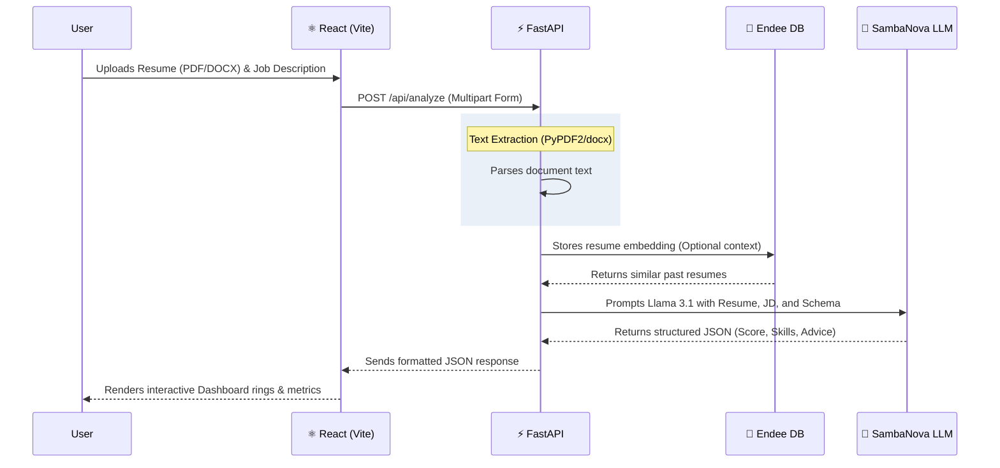

<div align="center">
  <h1>✨ Resume Matcher ✨</h1>
  <p><b>An AI-Powered Full-Stack Application for Intelligent Resume Analysis</b></p>
  
  [](https://fastapi.tiangolo.com/)
  [](https://reactjs.org/)
  [](https://vitejs.dev/)
  [](https://render.com/)
</div>

<br/>

Have you ever wondered what happens to your resume after you hit "Submit" on a job board? **Resume Matcher** pulls back the curtain. 

This full-stack application uses cutting-edge AI (powered by **SambaNova Cloud**) to act as an expert ATS (Applicant Tracking System) and career coach. It analyzes a resume against a job description, scores the match, identifies missing skills, and provides actionable advice.

---

## 🏗️ How It Works (Architecture)

The platform is designed to be blazing fast and scalable, utilizing a modern split-stack architecture.



---

## ✨ Key Features

*   📄 **Multi-Format Support:** Drag and drop PDFs, DOCX files, or simply paste raw text.
*   🎯 **Instant ATS Score:** Get a precise 0-100 compatibility score and a clear verdict (e.g., "Strong Match").
*   🔍 **Skill Gap Analysis:** A side-by-side breakdown of the skills you nailed and the buzzwords you're missing.
*   🧠 **Contextual Coaching:** 5 highly specific, actionable suggestions to tailor your resume for that exact role.
*   ⚡ **Lightning Fast:** Built on FastAPI and SambaNova's high-speed inference cloud.

---

## 💻 Local Development Setup

Want to run it on your own machine? It's easy! You'll need Python 3.11+, Node.js 18+, and a [SambaNova Cloud API key](https://cloud.sambanova.ai/).

### 1. The Backend (FastAPI)

```bash
cd backend
python -m venv venv
source venv/bin/activate        # Windows: venv\Scripts\activate

# Install the Python magic
pip install -r requirements.txt

# Setup your environment variables
cp .env.example .env
# Open .env and add your SAMBANOVA_API_KEY!

# Fire it up!
uvicorn main:app --reload --port 8000
```
*Your API is now running at `http://localhost:8000`. You can view the automated Swagger docs at `/docs`.*

### 2. The Frontend (React/Vite)

```bash
cd frontend
npm install

# Start the blazing-fast Vite dev server
npm run dev
```
*Your beautiful UI is now running at `http://localhost:5173`.*

---

## 🚀 One-Click Production Deployment (Render)

We've automated the entire deployment process using **Render Blueprints**. With a single configuration file (`render.yaml`), Render knows exactly how to build and host both the FastAPI backend and the React frontend simultaneously.


### Deploying the Complete Stack

1. Create a free account on [Render](https://render.com).
2. Go to your Dashboard and click **New +** → **Blueprint**.
3. Connect your GitHub repository containing this code.
4. Render will automatically read the `render.yaml` file and prepare two distinct services:
   *   `resume-matcher-backend` (A deployed Docker web service)
   *   `resume-matcher-frontend` (A lightning-fast global Static Site)
5. **Configure your Environment Variables:**

   **For the Backend (`resume-matcher-backend`):**
   *   `SAMBANOVA_API_KEY`: Your secret SambaNova Cloud API key.
   *   *(Optional)* `ENDEE_URL`: If you are using an external Vector Database. Leave dummy text if not.

   **For the Frontend (`resume-matcher-frontend`):**
   *   `VITE_API_URL`: The URL of your newly created backend (e.g., `https://resume-matcher-backend-xxxx.onrender.com`). *Note: Render creates the backend first, so you copy the URL and paste it here!*

6. Click **Apply**. 

🎉 That's it! Render will automatically pull the Docker image, assign dynamic ports (`$PORT`), build the static site, and wire everything together. Your intelligent Resume Matcher is live on the internet! 

---

*Built with ❤️ for modern job seekers.*
